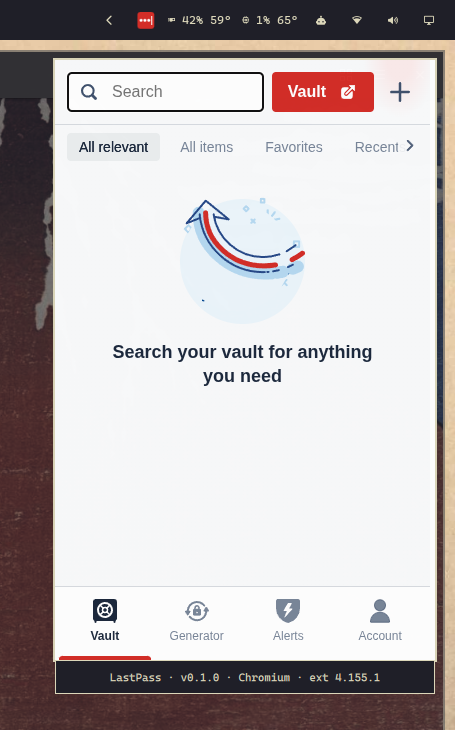

# LastPass Quick Access for Omarchy

An Omarchy Quattro bar widget that opens the installed LastPass browser
extension as a compact desktop popup. It does not read or handle vault data.

Built for my own Omarchy setup and shared in case it is useful to others. This
project is not affiliated with LastPass or Omarchy.



## What it does

- Open LastPass from the Omarchy bar without keeping a browser window open.
- Click the bar icon again to close the popup, or click another window to
  dismiss it.
- Carry the popup with you when switching workspaces.
- Right-click the bar icon to open or focus the full LastPass vault.
- Use Chromium, Chrome, Brave, or Microsoft Edge.
- Get a direct extension-store link when LastPass is not installed.
- See the active browser and installed extension version at a glance.
- Optionally open LastPass with a keyboard shortcut.

## Requirements

- Omarchy Quattro
- The LastPass extension installed in a supported Chromium-family browser
- Python 3, `hyprctl`, `uwsm-app`, and `wtype`, all included with Omarchy

The LastPass CLI is not required. The extension may be logged out; its normal
login screen will appear in the popup.

## Install

```bash
omarchy plugin add https://github.com/joecastro/omarchy-lastpass-plugin.git --enable
```

The widget starts on the right side of the bar. To move it:

```bash
omarchy bar move joecastro.lastpass --section right
```

For local development, place or link a checkout at:

```bash
~/.config/omarchy/plugins/joecastro.lastpass
```

## Configure

The plugin uses the first supported profile containing LastPass. To select a
browser explicitly:

```bash
omarchy bar set joecastro.lastpass browser edge
```

Valid values are `auto`, `chromium`, `chrome`, `brave`, and `edge`.

The popup defaults to 420 by 650 logical pixels. To resize it:

```bash
omarchy bar set joecastro.lastpass popupWidth 400 --json
omarchy bar set joecastro.lastpass popupHeight 600 --json
```

Width accepts 280–1200; height accepts 320–1400. Invalid values use the
defaults, and valid values are reduced when necessary to fit the active
monitor.

## Optional keyboard shortcut

Add this to `~/.config/hypr/bindings.lua` to replace Omarchy's default
1Password shortcut:

```lua
hl.unbind("SUPER + SHIFT + SLASH")
o.bind(
  "SUPER + SHIFT + SLASH",
  "LastPass Quick Access",
  "omarchy-shell joecastro.lastpass toggle"
)
```

The plugin does not modify global keybindings. For an optional Escape binding,
see [docs/escape-binding.md](docs/escape-binding.md).

## Controls

- **Left-click:** open or dismiss the extension menu.
- **Right-click:** open or focus the web vault.
- **Move the pointer away:** keep the menu open.
- **Click another window:** dismiss the menu.
- **Switch workspaces:** carry the menu to the selected workspace.
- **Click the information footer:** open the project page in the default
  browser.

## Remove

```bash
omarchy plugin remove joecastro.lastpass
```

Remove any optional keybinding or window rule you added separately.

## Notes

The plugin launches the UI from the installed LastPass extension. It does not
call LastPass APIs, invoke `lpass`, or access credentials. Like all Omarchy
Shell plugins, it runs without a sandbox; review the source before installing.

Browser extension pages are not a documented LastPass integration API. The
plugin discovers the current popup path to tolerate routine updates, but a
major extension change may require a plugin update.

In a tiling layout, opening the popup may briefly rearrange other windows
before the helper floats it. Add the optional
[floating-window rule](docs/floating-window-rule.md) to make it floating from
the moment it appears.

See [SECURITY.md](SECURITY.md) for the helper's data-access boundaries and
security notes.

## Tested with

- Omarchy 4 (Quattro)
- Chromium, Google Chrome, Brave, and Microsoft Edge

Browser and extension updates can change extension behavior. Please open an
issue if a supported browser stops working.

## Development

Install [uv](https://docs.astral.sh/uv/) and Qt's `qmllint`, then run:

```bash
export UV_PROJECT_ENVIRONMENT="${XDG_CACHE_HOME:-$HOME/.cache}/omarchy-lastpass-plugin/venv"
uv sync --locked
uv run --locked ruff check scripts/lastpass-popup scripts/lastpass_popup.py tests
uv run --locked ruff format --check scripts/lastpass-popup scripts/lastpass_popup.py tests
uv run --locked mypy
uv run --locked pytest
qmllint BarWidget.qml
```

On Omarchy, also run `omarchy plugin validate .`. Checking popup behavior still
requires an active Hyprland session and an installed LastPass extension.

In VS Code, run `Validate: All (CI equivalent)` from **Tasks: Run Task**. The
workspace also includes tasks for each check and for linking a checkout into
the local Omarchy plugin directory.

## Contributing

Bug reports and focused pull requests are welcome. The goal is to keep the
plugin understandable and useful in a real Omarchy setup.

## License

MIT. See [LICENSE](LICENSE).
